  

  <strong>Русский</strong> · <a href="./README_EN.md">English</a>

  <strong>Учусь через практику — превращаю идеи в понятные работающие сценарии.</strong> 
  Python · DevOps · QA · Web

  <a href="#проекты">Проекты</a> ·
  <a href="#сейчас-в-фокусе">Фокус</a> ·
  <a href="#использую-и-изучаю">Стек</a> ·
  <a href="https://github.com/mrjakeball/portfolio">Весь каталог ↗</a>

---

## Обо мне

Я **Алексей**. Учусь разработке через реальные задачи: собираю проекты, тестирую основные сценарии и постепенно делаю результат лучше.

Сейчас изучаю Python, основы DevOps, QA и веб-разработку. Здесь публикую только те работы, которые готов показать и объяснить.

> Мой рабочий цикл: **собрать → проверить → объяснить → улучшить**.

## Сейчас в фокусе

- **Python и автоматизация**
- **Linux, Docker и основы DevOps**
- **JavaScript, TypeScript и React**
- **QA и тестирование**
- **Git, GitHub и документация проектов**

## Использую и изучаю

  
  
  
  
  
  
  
  

## Проекты

У каждого проекта теперь своё место: короткий контекст, отдельная карточка и понятный следующий шаг. Витрины показывают реальные экраны, решения и ограничения, не раскрывая приватный код.

### Можно запустить

| **TEMPO PULSE** · `PWA` · `FITNESS` |
| :--- |
| Тренировки, питание и прогресс собраны в один мобильный ритм — без лишних переходов. |
| 

 |
| **[Смотреть витрину →](https://github.com/mrjakeball/tempo-pulse-showcase)** · **[Открыть PWA ↗](https://tempo-fitness-pwa.pages.dev/)** |

| **X‑TREME Shop Bot** · `TELEGRAM` · `COMMERCE` |
| :--- |
| Бот быстро считает заказ с Poizon или Taobao и проводит пользователя от ссылки до заявки. |
| 

 |
| **[Смотреть витрину →](https://github.com/mrjakeball/xtreme-shop-bot-showcase)** · **[Открыть в Telegram ↗](https://t.me/XtremeShopBot)** |

### Учебные и продуктовые сценарии

| **Кодограф ВВГУ** · `PYTHON` · `EDTECH` |
| :--- |
| Код пишется в Monaco и запускается прямо в браузере — учебная среда работает по-настоящему. |
| 

 |
| **[Смотреть витрину →](https://github.com/mrjakeball/kodograf-vvgu-showcase)** |

| **Pashtel** · `E-COMMERCE` · `UX` |
| :--- |
| Тёплая витрина пекарни ведёт от выбора выпечки до проверки заказа за пять ясных шагов. |
| 

 |
| **[Смотреть витрину →](https://github.com/mrjakeball/pashtel-showcase)** |

### Интерактив и инженерная практика

| **NOCTRA / LUCID-1** · `3D` · `R3F` |
| :--- |
| Движение и свет превращают знакомство с 3D-объектом в короткое интерактивное исследование. |
| 

 |
| **[Смотреть витрину →](https://github.com/mrjakeball/noctra-lucid-1-showcase)** |

| **World Cup 2026 Predictor** · `STATE` · `EXPORT` |
| :--- |
| Турнирный прогноз, личные награды и экспорт результата складываются в один понятный сценарий. |
| 

 |
| **[Смотреть витрину →](https://github.com/mrjakeball/world-cup-2026-predictor-showcase)** |

| **Linux & DevOps Trainer** · `LINUX` · `DEVOPS` |
| :--- |
| Теория переходит в терминал и практические сценарии — удобно готовиться и сразу пробовать команды. |
| 

 |
| **[Смотреть витрину →](https://github.com/mrjakeball/linux-devops-trainer-showcase)** |

### Следующий проект · iOS

| **CineFlow iOS** · `UIKIT` · `ROADMAP` |
| :--- |
| Честный план нативного каталога: карточка фильма, избранное и легальное воспроизведение трейлеров. |
| 

 |
| **[Посмотреть roadmap →](https://github.com/mrjakeball/cineflow-ios-showcase)** · Код ещё не начат |

  

