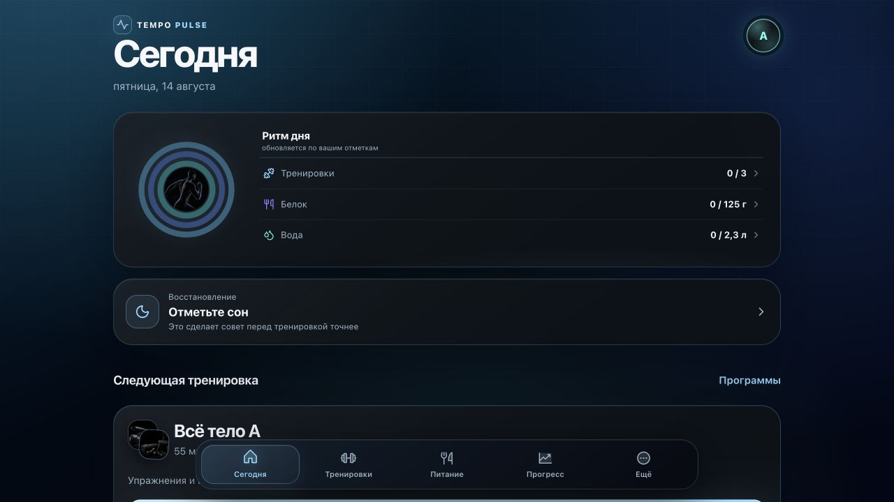
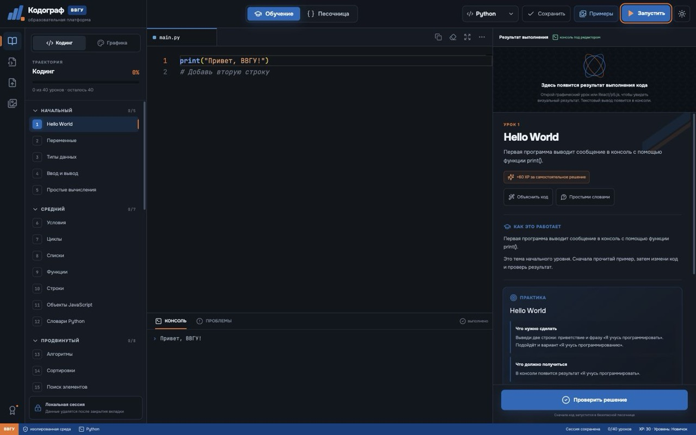
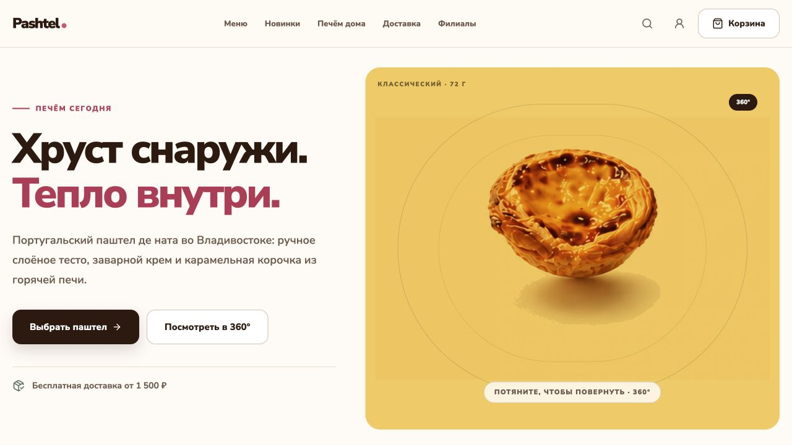
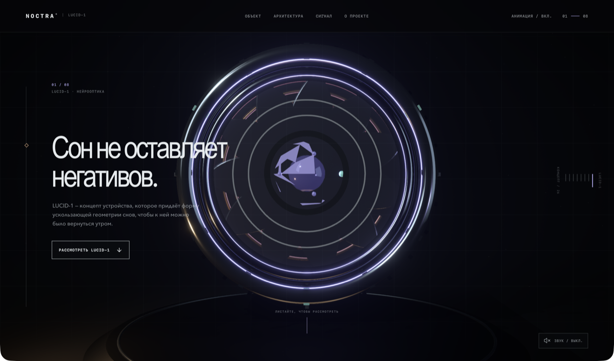
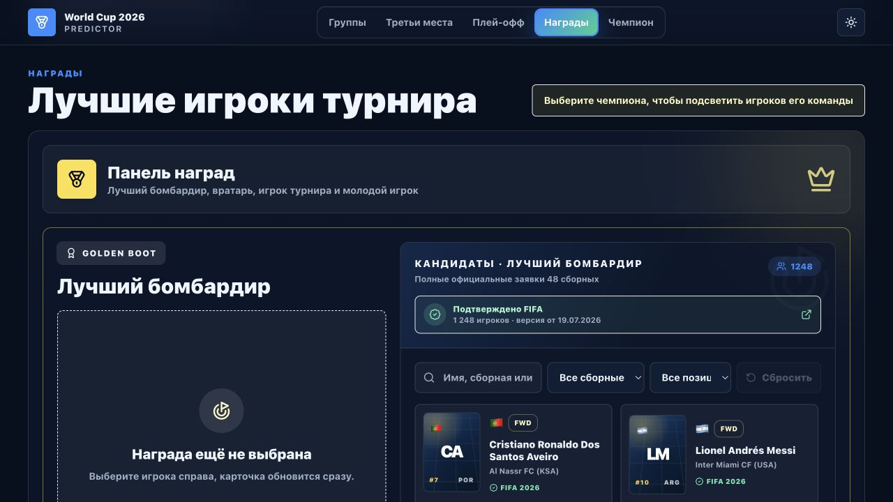
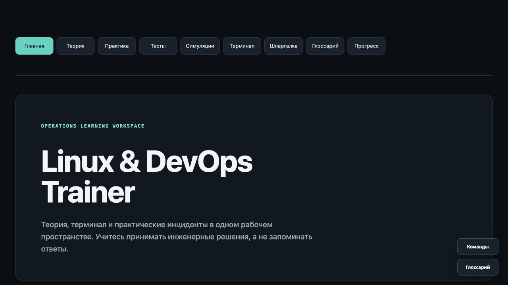

  

  <a href="./README.md">Русский</a> · <strong>English</strong>

  I learn by doing: building real projects and steadily developing in Python, DevOps, QA and web development.

---

## About me

I'm **Aleksei**. I learn software development through hands-on projects, testing and improving them as I go.

I'm currently studying Python, DevOps fundamentals, QA and web development. I only publish work here that I'm ready to show and explain.

## Current focus

- **Python and automation**
- **Linux, Docker and DevOps fundamentals**
- **JavaScript, TypeScript and React**
- **QA and testing**
- **Git, GitHub and project documentation**

## Tools and technologies

  
  
  
  
  
  
  
  

## Projects

These six projects were selected after reviewing their code, builds and main user flows. Some source repositories are still private or being prepared for publication.

### TEMPO PULSE

  

A mobile-first PWA for workouts, nutrition and progress tracking, with local data storage and offline flows.

`React 19` `TypeScript` `Dexie` `WebAuthn` `PWA`

[Open the app](https://tempo-fitness-pwa.pages.dev/) · **Status:** in active development, source currently private

### Kodograf VVGU

  

A learning environment with the Monaco editor, real Python execution in the browser, lessons and solution checks.

`Next.js` `Monaco` `Pyodide` `Web Worker` `Sandbox`

**Status:** repository being prepared for publication

### Pashtel

  

A responsive bakery storefront with a catalogue, cart, five-step checkout and server-side order recalculation.

`Next.js` `TypeScript` `API` `Checkout` `Accessibility`

**Status:** demo version being prepared for publication

### NOCTRA / LUCID-1

  

An interactive 3D project with a procedural model, PBR materials, lighting, sound and scroll-driven animation.

`React` `React Three Fiber` `Three.js` `GSAP` `Web Audio`

**Status:** repository being prepared for publication

### World Cup 2026 Predictor

  

A client-side tournament prediction builder covering groups, knockouts, awards, local saves and result export.

`React` `TypeScript` `Vite` `Zustand` `Vitest`

**Status:** in development, source currently private

### Linux & DevOps Trainer

  

An interview preparation trainer with theory, a terminal, practical labs and interactive simulations.

`Python` `Streamlit` `Linux` `DevOps` `Testing`

**Status:** repository being prepared for publication
